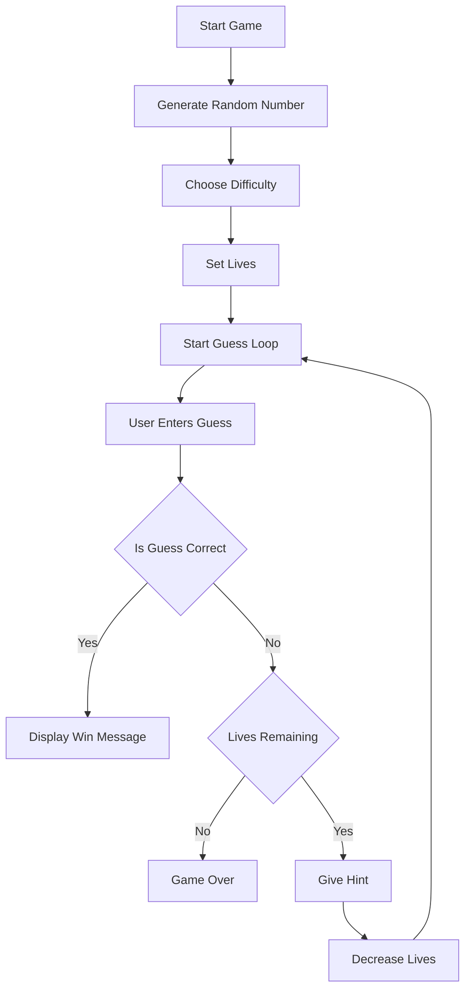

# 🎯 Number Guessing Game (Python)


A fun and interactive **command-line number guessing game** built using Python.  
This project demonstrates **control flow, loops, conditional logic, and user interaction** in a clean and structured way.

---

## 📌 Table of Contents

- 🚀 Features  
- 🧠 Game Flow  
- 💡 Hint System  
- 🛠️ Tech Stack  
- ▶️ How to Run  
- 📸 Example Gameplay  
- 🎯 Learning Outcomes    
- 🤝 Contributing  
- 📜 License  
- 👨‍💻 Author  
- ⭐ Support  

---

## 🚀 Features

| Feature | Description |
|--------|------------|
| 🎲 Random Number | Generates a number between 1 and 100 |
| 🎮 Difficulty Levels | Easy (10 lives), Hard (5 lives) |
| 💡 Smart Hints | Feedback based on guess accuracy |
| 🔁 Replay Option | Play again after game ends |
| ⌨️ CLI Interaction | Fully interactive command-line interface |
| ⚡ Real-Time Feedback | Instant response after every guess |

---

## 🧠 Game Flow



---
## 💡 Hint System

Make smarter guesses using dynamic feedback based on how close you are to the target number.

<table>
  <thead>
    <tr>
      <th>🎯 Difference (|guess - number|)</th>
      <th>💬 Feedback</th>
      <th>🔥 Meaning</th>
    </tr>
  </thead>
  <tbody>
    <tr>
      <td><strong>≥ 20</strong></td>
      <td>🔴 TOO HIGH / TOO LOW</td>
      <td>You are far away from the correct number</td>
    </tr>
    <tr>
      <td><strong>6 – 19</strong></td>
      <td>🟡 Keep Guessing</td>
      <td>You are getting closer, keep trying</td>
    </tr>
    <tr>
      <td><strong>≤ 5</strong></td>
      <td>🟢 TOO CLOSE</td>
      <td>You are very close to the correct number</td>
    </tr>
  </tbody>
</table>

---

### 🧪 Example Scenarios
Guess = 80, Actual = 50 →  TOO HIGH
Guess = 60, Actual = 50 →  Keep guessing
Guess = 48, Actual = 50 →  TOO CLOSE


---
## 🛠️ Tech Stack

Powering the game with simple yet effective technologies:

<table>
  <thead>
    <tr>
      <th>⚙️ Technology</th>
      <th>💡 Purpose</th>
    </tr>
  </thead>
  <tbody>
    <tr>
      <td><strong>🐍 Python 3</strong></td>
      <td>Core programming language used to build the game logic</td>
    </tr>
    <tr>
      <td><strong>🎲 random module</strong></td>
      <td>Generates unpredictable numbers for each game session</td>
    </tr>
    <tr>
      <td><strong>💻 CLI (Terminal)</strong></td>
      <td>Handles user input and displays real-time game feedback</td>
    </tr>
  </tbody>
</table>
---
## ▶️ How to Run

Follow these simple steps to set up and run the game on your local machine:

<table>
  <thead>
    <tr>
      <th>🚀 Step</th>
      <th>💻 Command</th>
      <th>📌 Description</th>
    </tr>
  </thead>
  <tbody>
    <tr>
      <td><strong>1️⃣ Clone Repository</strong></td>
      <td><code>git clone https://github.com/your-username/number-guessing-game.git</code></td>
      <td>Download the project to your local system</td>
    </tr>
    <tr>
      <td><strong>2️⃣ Navigate to Folder</strong></td>
      <td><code>cd number-guessing-game</code></td>
      <td>Move into the project directory</td>
    </tr>
    <tr>
      <td><strong>3️⃣ Run the Program</strong></td>
      <td><code>python game.py</code></td>
      <td>Start the game in your terminal</td>
    </tr>
  </tbody>
</table>

---

### ⚙️ Requirements

- 🐍 **Python 3** installed on your system  
- 💻 A terminal or command prompt to run the program  

--- 
## 📸 Example Gameplay

A quick preview of the game experience and interaction flow:

### 🎯 NUMBER GUESSING GAME 🎯
🎮 Select Difficulty → EASY

❤️ Lives Remaining : 10


🔢 Your Guess : 50


📢 Feedback : 🔴 TOO HIGH


💡 Hint : Try a smaller number


❤️ Lives Remaining : 9


🔢 Your Guess : 30


📢 Feedback : 🟡 KEEP GUESSING


💡 Hint : You are getting closer


❤️ Lives Remaining : 8


🔢 Your Guess : 48


📢 Feedback : 🟢 TOO CLOSE


💡 Hint : Just a little higher


## 💡Each guess brings you closer — use hints wisely and win before your lives run out!
---
## 🎯 Learning Outcomes

This project provides a strong foundation in core programming concepts and problem-solving skills:

<table>
  <thead>
    <tr>
      <th>📚 Concept</th>
      <th>💡 What You Learn</th>
    </tr>
  </thead>
  <tbody>
    <tr>
      <td><strong>🔀 Conditional Logic</strong></td>
      <td>Implement decision-making using <code>if-else</code> statements</td>
    </tr>
    <tr>
      <td><strong>🔁 Iteration</strong></td>
      <td>Use <code>while</code> loops to control repeated execution</td>
    </tr>
    <tr>
      <td><strong>🧩 Functions</strong></td>
      <td>Organize code into reusable and modular components</td>
    </tr>
    <tr>
      <td><strong>⌨️ User Input Handling</strong></td>
      <td>Capture and process real-time input from users</td>
    </tr>
    <tr>
      <td><strong>🧼 Clean Code Practices</strong></td>
      <td>Write readable, structured, and maintainable code</td>
    </tr>
    <tr>
      <td><strong>🧠 Problem Solving</strong></td>
      <td>Develop logical thinking and efficient solution-building skills</td>
    </tr>
  </tbody>
</table>


💡 *Overall, this project strengthens my ability to design interactive programs with clear logic and structure.*
---
## 🤝 Contributing

Contributions are always welcome!

I’m genuinely open to collaborating with anyone who is interested in improving this project. Whether you're a beginner looking to learn, or someone experienced wanting to enhance features, fix bugs, or optimize the code — you’re absolutely welcome here. Feel free to share ideas, suggest improvements, or build new features. Let’s learn and grow together by contributing to this project 🚀

### Steps to contribute:

- Fork this repository  
- Create a new branch  
  ```bash
  git checkout -b feature-name
  Make your changes

Commit your changes


---
## 📜 License

<div align="center">

### 🛡️ MIT License

This project is licensed under the **MIT License** — giving you the freedom to use, modify, and distribute the code with minimal restrictions.

</div>

---

### 🔓 What this means for you

- ✅ Use this project for **personal or commercial purposes**
- 🔧 Modify and customize the code as per your needs  
- 📤 Distribute your own versions freely  
- ⚠️ Just make sure to include the original license

---

### 💡 In simple words

> You are free to do almost anything with this project — just give proper credit.

---

📄 For full license details, refer to the `LICENSE` file in the repository.


---


## 👨‍💻 Author

<div align="center">

###  Prem Kumar  

💡 *Passionate about building, learning, and sharing knowledge in tech*

</div>

---

### 🌟 About Me

- 🎓 Student exploring the world of technology  
- 💻 Interested in **programming, development, and problem-solving**  
- 🚀 Building projects to learn and grow consistently  

---

### 🤝 Let’s Connect

I’m always open to connecting with like-minded people, collaborating on projects, and learning together.

> *“Keep building. Keep learning. Keep going beyond.”*

---

## ⭐ Support

<div align="center">

### 💙 Show Your Support

If you found this project helpful or interesting, consider supporting it!

</div>

---

### 🚀 Ways to Support

- ⭐ **Star this repository** to show appreciation  
- 🍴 **Fork the project** and build your own version  
- 🛠️ **Contribute** by adding features or improvements  
- 📢 **Share it** with others who might find it useful  

---

### 💡 Why it matters

> Your support motivates me to keep building, improving, and creating more useful projects for the community.

---

✨ *Every star and contribution makes a difference!*

