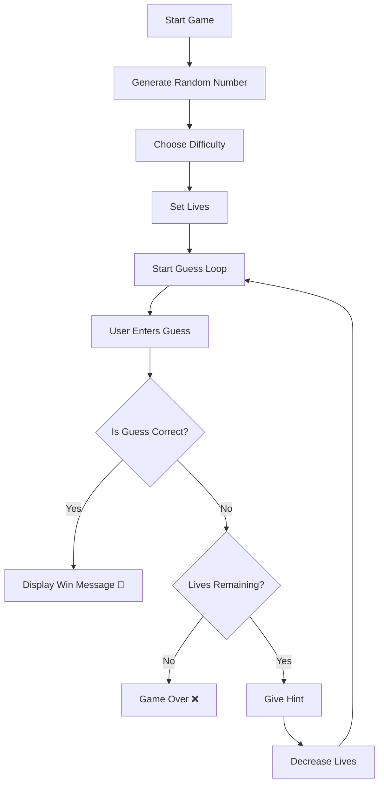

# 🎯 Number Guessing Game (Python)

A fun and interactive **command-line number guessing game** built using Python.  
This project demonstrates **control flow, loops, conditional logic, and user interaction** in a clean and structured way.

---

## 📌 Table of Contents

- 🚀 Features  
- 🧠 Game Flow  
- 💡 Hint System  
- 🛠️ Tech Stack  
- ▶️ How to Run  
- 📸 Example Gameplay  
- 🎯 Learning Outcomes  
- 🔄 Future Improvements  
- 🤝 Contributing  
- 📜 License  
- 👨‍💻 Author  
- ⭐ Support  

---

## 🚀 Features

| Feature | Description |
|--------|------------|
| 🎲 Random Number | Generates a number between 1 and 100 |
| 🎮 Difficulty Levels | Easy (10 lives), Hard (5 lives) |
| 💡 Smart Hints | Feedback based on guess accuracy |
| 🔁 Replay Option | Play again after game ends |
| ⌨️ CLI Interaction | Fully interactive command-line interface |
| ⚡ Real-Time Feedback | Instant response after every guess |

---

## 🧠 Game Flow

---
## 💡 Hint System

Make smarter guesses using dynamic feedback based on how close you are to the target number.

<table>
  <thead>
    <tr>
      <th>🎯 Difference (|guess - number|)</th>
      <th>💬 Feedback</th>
      <th>🔥 Meaning</th>
    </tr>
  </thead>
  <tbody>
    <tr>
      <td><strong>≥ 20</strong></td>
      <td>🔴 TOO HIGH / TOO LOW</td>
      <td>You are far away from the correct number</td>
    </tr>
    <tr>
      <td><strong>6 – 19</strong></td>
      <td>🟡 Keep Guessing</td>
      <td>You are getting closer, keep trying</td>
    </tr>
    <tr>
      <td><strong>≤ 5</strong></td>
      <td>🟢 TOO CLOSE</td>
      <td>You are very close to the correct number</td>
    </tr>
  </tbody>
</table>

---

### 🧪 Example Scenarios
Guess = 80, Actual = 50 →  TOO HIGH
Guess = 60, Actual = 50 →  Keep guessing
Guess = 48, Actual = 50 →  TOO CLOSE

---
## 🛠️ Tech Stack

Powering the game with simple yet effective technologies:

<table>
  <thead>
    <tr>
      <th>⚙️ Technology</th>
      <th>💡 Purpose</th>
    </tr>
  </thead>
  <tbody>
    <tr>
      <td><strong>🐍 Python 3</strong></td>
      <td>Core programming language used to build the game logic</td>
    </tr>
    <tr>
      <td><strong>🎲 random module</strong></td>
      <td>Generates unpredictable numbers for each game session</td>
    </tr>
    <tr>
      <td><strong>💻 CLI (Terminal)</strong></td>
      <td>Handles user input and displays real-time game feedback</td>
    </tr>
  </tbody>
</table>

---
## ▶️ How to Run

Follow these simple steps to set up and run the game on your local machine:

<table>
  <thead>
    <tr>
      <th>🚀 Step</th>
      <th>💻 Command</th>
      <th>📌 Description</th>
    </tr>
  </thead>
  <tbody>
    <tr>
      <td><strong>1️⃣ Clone Repository</strong></td>
      <td><code>git clone https://github.com/your-username/number-guessing-game.git</code></td>
      <td>Download the project to your local system</td>
    </tr>
    

---

### ⚙️ Requirements

- 🐍 **Python 3** installed on your system  
- 💻 A terminal or command prompt to run the program  

